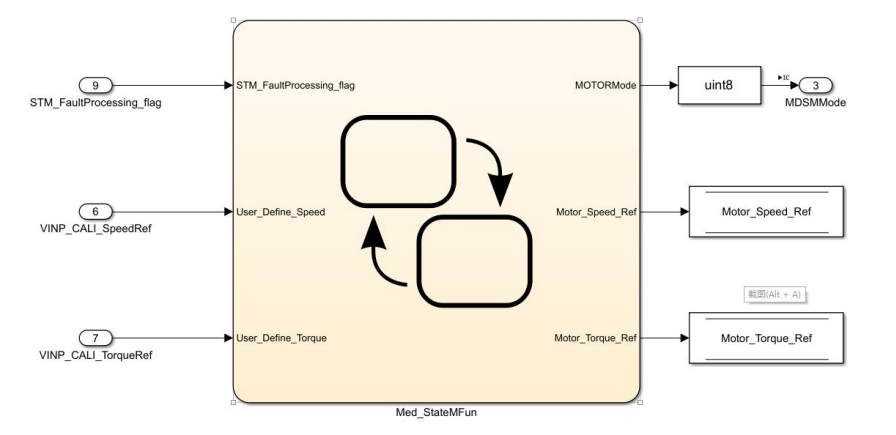

# 整体框架
中频任务：状态机、参考电流
高频任务：FOC矢量控制
安全任务：电压保护、电流保护、温度保护
# 中频任务
包含状态机和参考电流
## 状态机模块

| Singnal  | Type  | Model | Description  |
| -------- | ----- | ----- | ------------ |
| MDSMMode | Uint8 | None  | 观测电机状态 |
|          |       |       |              |
## 实现策略
中频任务在2ms内被调用，监管电机系统状态、统筹任务间数据，与用户交互控制电机运行。

上图显示了状态机最外层逻辑，MOTOR_CONTROL子状态包含了电机从启动到运转的完整状态逻辑，此子状态还会进行状态错误判断。当错误标志位置一时，状态切换为FAULT子状态，在FAULT子状态